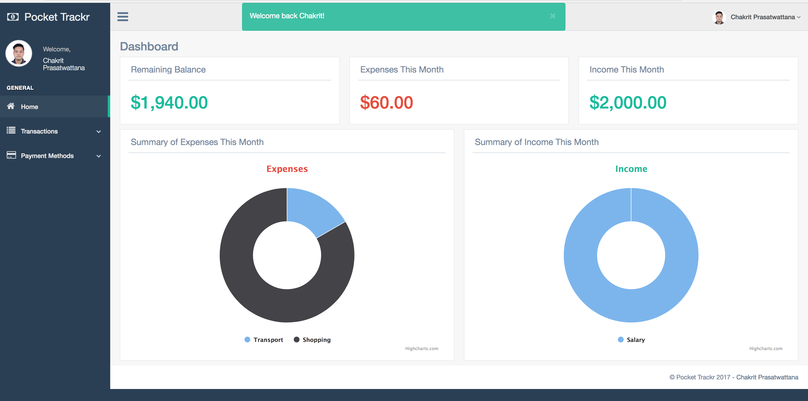

# POCKET TRACKR

This app allows you to input your daily expenses and income to give you an in-depth view on what you're spending your money on each day and where you're saving

Pocket Trackr can be found at [https://pocket-trackr.herokuapp.com/](https://pocket-trackr.herokuapp.com/)

## How It Works
When visiting the link above, the user will be brought to a user signup or login page. They can either login with an existing account or create a new account. After logging into the system, the user can input new transactions (either income or expenses) by specifying which payment method they used (e.g. cash, card).

They also can input new forms of payment methods such as Debit Card and Credit Cards as a form of keeping track of which payment method is used for which transactions. Here, only the last 4 digits of the a debit/credit card is stored.

Pocket Trackr uses the records of transactions to display a summary of expenses and income in pie charts and in numbers. Transactions can also be viewed per payment method.

Users can also edit and delete transactions and payment methods as well as modify their personal profile (e.g. name, email, etc.) and upload a profile photo.

There is also an admin system where a designated administrator with pre-set username and password can keep track of users' details.

## Development and Technologies
Pocket Trackr was built using the following technologies:

- HTML
- CSS/SASS
- Javascript/jQuery
- Ruby/Ruby on Rails

The following additional gems were also used:

- [bcrypt](https://github.com/codahale/bcrypt-ruby) (for encryption of passwords)
- [gentelella-rails](https://github.com/mwlang/gentelella-rails) (the visual theme for the Pocket Trackr app once the user has logged in)
- [highcharts-rails](https://github.com/PerfectlyNormal/highcharts-rails) (for pie charts)
- [gon](https://github.com/gazay/gon) (to use ruby variables in javascript efficiently)
- [rails-assets-sweetalert2](https://github.com/nicolasblanco/sweet-alert2-rails) (for pretty confirm prompts)
- [paperclip](https://github.com/thoughtbot/paperclip) (to upload files)
- [aws-sdk](https://github.com/aws/aws-sdk-ruby) (to store files)
- [dotenv-rails](https://github.com/bkeepers/dotenv) (to store private environment variables)
- [active-admin](https://github.com/activeadmin/activeadmin) (administrative backend)

A list of the tasks and workflow can be found on this [Trello board](https://trello.com/b/Z8eh3dpv/budget-tracker)

## User Stories
Main user stories:

- As a non-authenticated user, I want to be able to log in or sign up to use the application in a secure manner
- As a logged in user, I want to be able to create, view, update and delete transactions to keep track of what I'm spending my money on
- As a logged in user, I want to be able to create, view, update and delete payment methods (debit/credit cards) to keep track of my transactions
- As a logged in user, I want to be able to change my profile and delete my profile if I want
- As a logged in user, I want to be able to see a visual representation/summary of my expenses in the form of a number or a chart to be able to view the data in a more coherant manner
- As an admin, I want to be able to view the users' information to get a general overview of users' behaviors and trends

## Wireframes / Screenshots
Wireframes can be found at the [Trello board](https://trello.com/b/Z8eh3dpv/budget-tracker)
where some screenshots from the app are listed below:

## ERD
A visual representation of the relationships between models is shown below:

## MVP
- Implemented using 4 models: User, PaymentMethod, Transaction and AdminUser
- Signup and Login functionality
- Payment Method CRUD
- Transaction CRUD

## Features for the Future
- Mobile responsive
- Pagination for payment methods and transactions
- Quick Transaction input feature
  - Button to add a repeated transaction on the dashboard
  - Suggestions on repeated transactions
- Calendar to list an overview of transactions
- Charts and graphs based on a user search filter (e.g. based on a certain month)
- Integrate real time with a payment API (i.e. non manual input)

# Installation Instructions
To implement this app:

- clone the repository
- run `bundle install`
- run `rails server`
- visit [http://localhost:3000](http://localhost:3000) in the browser

